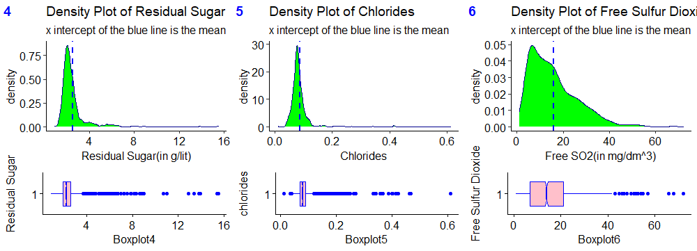
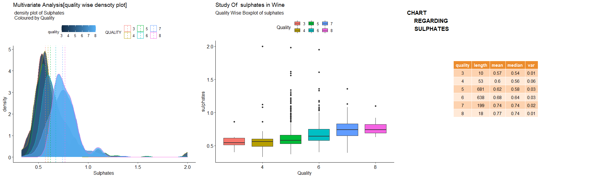

# Red-Wine-Quality

# 
# Business Understanding

The red wine industry shows a recent exponential growth as social drinking is on the rise. Nowadays, industry players are using product quality certifications to promote their products. This is a time-consuming process and requires the assessment given by human experts, which makes this process very expensive. Also, the price of red wine depends on a rather abstract concept of wine appreciation by wine tasters, opinion among whom may have a high degree of variability. Another vital factor in red wine certification and quality assessment is physicochemical tests, which are laboratory-based and consider factors like acidity, pH level, sugar, and other chemical properties. The red wine market would be of interest if the human quality of tasting can be related to wine’s chemical properties so that certification and quality assessment and assurance processes are more controlled. This project aims to determine which features are the best quality red wine indicators and generate insights into each of these factors to our model’s red wine quality.

<!-- 
# 
# About the Dataset:
Now, a brief overview of the Red Wine Quality Dataset.
The main aim of the red wine quality dataset is to predict which of the physiochemical features make good wine. With 11 variables and 1 output variable (quality) given, let us examine the role of each of these features:
Fixed Acidity: are non-volatile acids that do not evaporate readily
Volatile Acidity: are high acetic acid in wine which leads to an unpleasant vinegar taste
Citric Acid: acts as a preservative to increase acidity. When in small quantities, adds freshness and flavor to wines
Residual Sugar: is the amount of sugar remaining after fermentation stops. The key is to have a perfect balance between sweetness and sourness. It is important to note that wines > 45g/ltrs are sweet
Chlorides: the amount of salt in the wine
Free Sulfur Dioxide: it prevents microbial growth and the oxidation of wine
Total Sulfur Dioxide: is the amount of free + bound forms of SO2
Density: sweeter wines have a higher density
pH: describes the level of acidity on a scale of 0–14. Most wines are always between 3–4 on the pH scale
Alcohol: available in small quantities in wines makes the drinkers sociable
Sulphates: a wine additive that contributes to SO2 levels and acts as an antimicrobial and antioxidant
Quality: which is the output variable/predictor
Now we have a basic knowledge of various factors that influence the quality of good wine, Shall we drink to that?

# Data Preparation
### Data Cleaning
My first step was to clean and prepare the data for analysis. I went through different steps of data cleaning. First, I checked the data types focusing on numerical and categorical to simplify the correlation’s computation and visualization. Second, I tried to identify any missing values existing in our data set. Last, I researched each column/feature’s statistical summary to detect any problem like outliers and abnormal distributions.

4. Data Exploration and Visualization: this helps in effectively interpreting each feature in the wine data
5. Train the algorithm: using Multivariable Regression and Random Forest Classification to identify patterns and relationship between the targets and features
6. Evaluate your model (Regression and Classification) using a few metrics:
a. Skew: a normal distribution close to zero is a perfect distribution
b. MSE (Mean Squared Error): is an absolute measure of fit. Note that an MSE of 0 indicates a perfect fit)
c. RMSE (Root Mean Squared Error): is a good measure of how accurate the model predicts the target
d. R-Squared: is a relative measure of fit
e. Confusion Matrix (Accuracy, Precision, Recall)
Also, the use of BIC (Bayesian Information Criterion) for model selection in measuring complexity; where the model with the lower BIC Value,is the preferred.

 -->

# Some Visualizations:

visualization_R/Rplot02.png

Here is the visualization part of various dependencies of quality of wine from [**RED WINE QUALITY dataset** (_P. Cortez, A. Cerdeira, F. Almeida, T. Matos and J. Reis.
Modeling wine preferences by data mining from physicochemical properties. In Decision Support Systems, Elsevier, 47(4):547-553, 2009._)]( https://www.kaggle.com/uciml/red-wine-quality-cortez-et-al-2009) . And also I have done some analysis on the deciding factors of the quality of Red wine.It is a detaild explaination.

You can find two .R file. 1st run all the lines of both the files once. This time ignore all the warnings and errors.
Next run again the code , now try to understand the codes , you can easily understand and get all plots. Though some plots may take time to arrive please wait for soemtime if anyplot shows no error but just warning . I guess in the middle portion you may struggle to get some plots . I am providing all the plots here too. 

I shall add a report explaining all the things though , you are requested to do further work for a regression model that can predict the quality . And you can also take it as a classification problem to solve ( considering quality of 3,4 as low-quality;  5,6 as medium quality and 7,8 as high quality )
If you have any question to ask me please feel free to ask . and I will be happy to help you . Email ID:  mahendranandi.rkma@gmail.com
